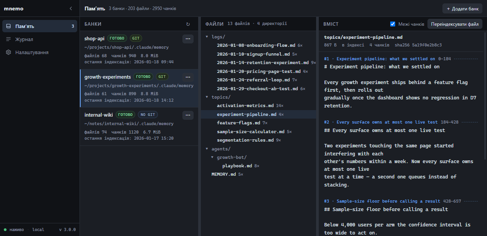
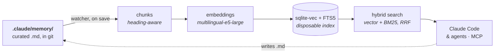

# mnemo

**Project memory for Claude Code and agents.** Your markdown stays the source
of truth; mnemo keeps it searchable, locally, without ever becoming a place
where something is stored.

You write `.md`. A background service notices the save, re-indexes it within
seconds, and any agent in the project can find it by meaning — not by
remembering which file it was in.



<sub>The local cabinet — `mnemo ui`. Every bank with its index state, the
file tree, any document with **the chunk boundaries drawn in**, live progress
and the journal.</sub>



Everything to the right of the markdown is derived. Delete the index and it
rebuilds identically; nothing but plain `.md` and a little wiring lives in
your repo.

## How it works

**The loop closes by itself.** An agent finishes a piece of work and writes
what it learned into `.claude/memory/topics/queue.md`. Before the next
message is typed, a watcher has already picked up the save, re-chunked that
one file and embedded the parts that changed. Ask anything in a session an
hour later — or on a different machine after a `git pull` — and the answer
is found by *meaning*, across files, without anyone remembering where it was
written down.

That is the whole difference from a `MEMORY.md` that everyone is supposed to
read: nothing has to be loaded up front, nothing competes for the context
window, and memory does not go stale between the moment it is written and
the moment it is indexed.

Three properties are load-bearing, and each one is a deliberate constraint:

- **The markdown is the only source of truth.** It is reviewed in pull
  requests and it travels in git, like code. There is no write API and there
  will not be one — you edit memory with the same editor you edit everything
  else.
- **The index is disposable.** Chunks, vectors and the SQLite file are
  derived; delete them and the next run rebuilds an identical index. Nothing
  is ever *only* in the index, so nothing can be lost in it.
- **Nothing leaves the machine.** Embeddings are computed locally by a
  resident model, the service listens on loopback behind a token, and no
  content is sent anywhere.

### Banks

A **bank** is one root folder of `.md` — anywhere on disk — indexed as a
whole. For a project that is `<project>/.claude/memory/`, and everything
nested inside it is one searchable set.

There are no scopes *inside* a bank, on purpose. If two sets of notes must
not see each other — a private research folder, a second project, per-agent
notes kept apart — that is a **second bank**, with its own token and its own
MCP connection. A search can be narrowed to a subfolder with
`--path-prefix`, but that is navigation, not a wall: the wall is the bank
boundary, and it is the folder, which means there is no exclusion list to
maintain and nothing to get wrong.

One machine, one service, any number of banks. A project usually has one.

### Many sessions, many projects, one service

Nothing here is owned by a single client, and that is a consequence of the
shape rather than a feature bolted on: the service is a **server**, and
everything else is a client of it.

- **Open as many Claude Code sessions on the same project as you like.**
  They do not spawn anything — each one *connects* to the service that is
  already running. No per-session process, no lock file, no "the other
  console has it open". Every MCP request is self-contained and carries its
  own bank in its own token, so there is no session affinity to conflict
  over: two consoles, ten consoles and a `curl` are the same thing to the
  backend.
- **One service holds every project on the machine.** Banks are a registry,
  not an instance — project number seven costs one entry, not another
  watcher and another 1.6 GB of resident model. A search in one project
  never waits on an index rebuild in another; the queue puts a single edit
  ahead of a bulk reindex on purpose.
- **Any MCP client, not just Claude Code.** The project face is ordinary
  HTTP MCP plus a token — anything that speaks MCP connects with a URL, and
  anything that speaks `curl` can use `/mcp-tools/*` and read exactly what
  an agent reads.

---

## 1. Install the engine (once per machine)

```powershell
git clone https://github.com/DIMKA4621/mnemo.git
cd mnemo; .\install.ps1
```
```bash
git clone https://github.com/DIMKA4621/mnemo.git
cd mnemo && ./install.sh
```

That is the whole machine setup: virtualenv, dependencies, launcher, API
token, autostart, the embedding model (~2.2 GB — it asks first), the service
started, and finally `doctor`, so the last thing on screen is the engine
reporting its own state rather than a claim that it worked.

Re-running the installer is also the update path — it stops the service,
re-mirrors the code and brings it back. `.\uninstall.ps1` / `./uninstall.sh`
is the mirror image.

<sub>Windows 10/11 with built-in PowerShell 5.1+, or Linux/macOS. 64-bit
Python 3.10+ — and on macOS specifically, a Python built with **loadable
SQLite extensions**: Homebrew's has them, the python.org build does not, and
without them the vector index cannot load at all. The installer checks and
says so, rather than letting it surface at your first search. No Docker, no
WSL, no PATH changes. Flags for scripts and CI:
`--no-model`, `--model`, `--no-start`, `--check`, `--deps-only`,
`--no-autostart`, `--home DIR`.</sub>

**One thing to know before the next step.** The launcher lands at
`~/.claude/mnemo/bin/mnemo` (`bin\mnemo.exe` on Windows) and is deliberately
**not** added to `PATH` — mnemo does not edit your shell environment. Either
call it by full path, or give yourself a short name once:

```powershell
# PowerShell profile:  notepad $PROFILE
Set-Alias mnemo "$HOME\.claude\mnemo\bin\mnemo.exe"
```
```bash
# ~/.bashrc or ~/.zshrc
alias mnemo=~/.claude/mnemo/bin/mnemo
```

The rest of this README writes the short `mnemo`. The git-tracked wiring
never depends on it: it uses the portable path, so it works either way.

## 2. Attach a project (once per project)

```powershell
cd C:\path\to\your\project
mnemo init
```
```bash
cd /path/to/your/project
mnemo init
```

`init` registers `<project>/.claude/memory/` as a **bank**, indexes it, and
writes the wiring. It is additive and idempotent: it only ever adds its own
keys, and it explains itself before doing anything it cannot undo.

| File | In git? | What it is |
|---|---|---|
| `.claude/memory/MEMORY.md` | yes | a one-line index to grow from |
| `.claude/rules/mnemo-memory.md` | yes | the binding memory rule — loads for the session **and every subagent** |
| `.mcp.json.template`, `.mcp.env.example`, `mcp-setup.sh`, `mcp-setup.ps1` | yes | the wiring, with placeholders |
| `.mcp.env` | **no** | this bank's own token |
| `.mcp.json` | **no** | built from the two above, by the last step |

The split is the point: everything a teammate needs travels with the repo,
and the one thing that must not — a live credential — does not.

Build the config and restart Claude Code:

```powershell
powershell -NoProfile -File .\mcp-setup.ps1
```
```bash
bash mcp-setup.sh
```

The session now has `search` and `tree` over the project's memory. Anyone
who clones the repo does the same, after pasting their own token for that
bank — from the cabinet — into `.mcp.env`.

## 3. Use it

**Agents.** The rule that `init` installs says it in one line: *search first,
then answer.* Nothing is injected into the context — memory that is not
searched for is memory not used, and an injection would let an agent believe
it had already looked.

**You.** `mnemo ui` prints the link to the cabinet shown above — every
per-bank action lives in one `···` menu there (sync, full rebuild, MCP
access, remove). `mnemo search "query"` answers the same question from the
terminal, and `mnemo doctor` says whether anything on this machine needs
attention.

**Editing memory is editing files.** There is no write tool and there will
not be one: you use the same editor and the same git as for everything else,
and the watcher does the rest.

---

## Commands

```
mnemo init [--root DIR] [--yes] [--migrate]   wire a project
mnemo search "query" [--path-prefix P]        hybrid search over a bank
mnemo status | logs | tree | ui               state, journal, layout, cabinet link
mnemo banks list | add <path> | remove <ref>  the registry
mnemo reindex [--bank B] [--full]             force the issue (the watcher is automatic)
mnemo service start | stop | status | restart
mnemo doctor                                  engine, model, tokens, ports, banks, wiring
mnemo warmup                                  explicit model download — never implicit
```

`ui` prints a link and opens nothing: which browser and which signed-in
profile would receive a URL carrying the service token is not a decision a
CLI command gets to make.

## How it is put together

- **One service.** A single loopback backend owns the registry, the index and
  the file watcher; the CLI, the MCP faces and the cabinet are all thin
  clients of it. A second resident process holds the embedding model warm
  (~1.6 GB) so a search costs milliseconds, not seconds.
- **Two MCP faces, told apart by the token presented.**
  `/mcp?token=<bank-token>` is what a project is wired to: read-only,
  `search` and `tree`, over the one bank that token belongs to. The token
  *is* the address — there is no bank name anywhere in the URL, because a
  second thing naming the bank could only ever disagree with the credential.
  `/mcp-admin?token=<service-token>` manages banks. Neither credential opens
  the other's face.
- **Everything is on loopback, behind a token**, and nothing is exposed
  outward without an explicit decision. The model is downloaded only by
  `warmup`, never implicitly by a search, a hook or a service.
- **Layout.** `MEMORY.md` as a thin index, `logs/` for day notes, `topics/`
  one concept per file, `agents/<role>/` for per-role notes — all nested
  under one root, which is why the bank never swallows your `skills/`,
  `rules/` or `agents/`. The boundary is the folder, so there is no exclusion
  list to maintain.

## Develop

This repository **is** the system. `install.sh` / `install.ps1` mirrors
`src/` into the engine home; tests run against the source:

```powershell
py -3 -m venv .venv; .\.venv\Scripts\pip install -r requirements.txt
.\.venv\Scripts\python tests\test_platform.py   # wiring and scaffold plans
.\.venv\Scripts\python tests\test_pipeline.py   # .md -> vectors -> search
.\.venv\Scripts\python tests\test_search.py     # labeled recall eval
```

The installer suites are per-platform and each runs the real thing into a
throwaway engine home: `tests\test_install_windows.py` on Windows,
`tests/test_install_posix.py` on Linux and macOS. CI runs all of the above
except `test_search.py`, which needs the model.

Design source of truth (Ukrainian): `docs/Memory-design-v3.md` (what and
why), `docs/Memory-requirements-v3.md` (FR/NFR),
`docs/Memory-implementation-v3.md` (stack, blocks, phases),
`docs/Memory-contracts-v3.md` (module ownership and exact API shapes) and
`docs/Setup-design.md` (the install model). `docs/Memory-design-v2.md` and
`-v1.md` are historical; `docs/containers/` describes a container recipe
still being redesigned for the service model.

> **v3 is on `feat/v3`.** This README describes it. `master` still carries
> v2, where there was no service and no cabinet.
