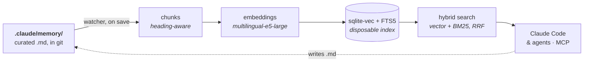

# mnemo

**Project memory for Claude Code and agents.** Your markdown stays the source
of truth; mnemo keeps it searchable, locally, without ever becoming a place
where something is stored.

You write `.md`. A background service notices the save, re-indexes it within
seconds, and any agent in the project can find it by meaning — not by
remembering which file it was in.



Everything to the right of the markdown is derived. Delete the index and it
rebuilds identically; nothing but plain `.md` and a little wiring lives in
your repo.

---

## 1. Install the engine (once per machine)

```powershell
git clone https://github.com/DIMKA4621/mnemo.git
cd mnemo; .\install.ps1
```
```bash
git clone https://github.com/DIMKA4621/mnemo.git
cd mnemo && ./install.sh
```

That is the whole machine setup: virtualenv, dependencies, launcher, API
token, autostart, the embedding model (~2.2 GB — it asks first), the service
started, and finally `doctor`, so the last thing on screen is the engine
reporting its own state rather than a claim that it worked.

Re-running the installer is also the update path — it stops the service,
re-mirrors the code and brings it back. `.\uninstall.ps1` / `./uninstall.sh`
is the mirror image.

<sub>Windows 10/11 with built-in PowerShell 5.1+, or Linux/macOS. 64-bit
Python 3.10+. No Docker, no WSL, no PATH changes. Flags for scripts and CI:
`--no-model`, `--model`, `--no-start`, `--check`, `--deps-only`,
`--no-autostart`, `--home DIR`.</sub>

## 2. Attach a project (once per project)

```powershell
cd C:\path\to\your\project
& "$HOME\.claude\mnemo\bin\mnemo.exe" init
```
```bash
cd /path/to/your/project
~/.claude/mnemo/bin/mnemo init
```

`init` registers `<project>/.claude/memory/` as a **bank**, indexes it, and
writes the wiring. It is additive and idempotent: it only ever adds its own
keys, and it explains itself before doing anything it cannot undo.

| File | In git? | What it is |
|---|---|---|
| `.claude/memory/MEMORY.md` | yes | a one-line index to grow from |
| `.claude/rules/mnemo-memory.md` | yes | the binding memory rule — loads for the session **and every subagent** |
| `.mcp.json.template`, `.mcp.env.example`, `mcp-setup.sh`, `mcp-setup.ps1` | yes | the wiring, with placeholders |
| `.mcp.env` | **no** | this bank's own token |
| `.mcp.json` | **no** | built from the two above, by the last step |

The split is the point: everything a teammate needs travels with the repo,
and the one thing that must not — a live credential — does not.

Build the config and restart Claude Code:

```powershell
powershell -NoProfile -File .\mcp-setup.ps1
```
```bash
bash mcp-setup.sh
```

The session now has `search` and `tree` over the project's memory. Anyone
who clones the repo does the same, after pasting their own token for that
bank — from the cabinet — into `.mcp.env`.

## 3. Use it

**Agents.** The rule that `init` installs says it in one line: *search first,
then answer.* Nothing is injected into the context — memory that is not
searched for is memory not used, and an injection would let an agent believe
it had already looked.

**You.** Open the cabinet:

```
mnemo ui
```

It lists every bank with its file tree, shows a document with its chunk
boundaries drawn in, streams indexing progress live, and hands out each
bank's MCP config from one `···` menu — reindex, full rebuild, access,
remove.

**Editing memory is editing files.** There is no write tool and there will
not be one: you use the same editor and the same git as for everything else,
and the watcher does the rest.

---

## Commands

```
mnemo init [--root DIR] [--yes] [--migrate]   wire a project
mnemo search "query" [--path-prefix P]        hybrid search over a bank
mnemo status | logs | tree | ui               state, journal, layout, cabinet
mnemo banks list | add <path> | remove <ref>  the registry
mnemo reindex [--bank B] [--full]             force the issue (the watcher is automatic)
mnemo service start | stop | status | restart
mnemo doctor                                  engine, model, tokens, ports, banks, wiring
mnemo warmup                                  explicit model download — never implicit
```

The launcher is at `~/.claude/mnemo/bin/mnemo` (`bin\mnemo.exe` on Windows)
and is deliberately **not** on `PATH`; add it yourself or call it in full.
The git-tracked wiring always uses the portable form, so it works either way.

## How it is put together

- **Banks.** A bank is any root folder of `.md`, anywhere on disk, indexed
  whole — no scopes inside it. Need memory kept apart, per agent or per
  domain? That is a second bank with its own token, not a scope.
  `--path-prefix` narrows a search, but that is navigation, not isolation.
- **One service.** A single loopback backend owns the registry, the index and
  the file watcher; the CLI, the MCP faces and the cabinet are all thin
  clients of it. A second resident process holds the embedding model warm
  (~1.6 GB) so a search costs milliseconds, not seconds.
- **Two MCP faces, told apart by the token presented.**
  `/mcp?token=<bank-token>` is what a project is wired to: read-only,
  `search` and `tree`, over the one bank that token belongs to. The token
  *is* the address — there is no bank name anywhere in the URL, because a
  second thing naming the bank could only ever disagree with the credential.
  `/mcp-admin?token=<service-token>` manages banks. Neither credential opens
  the other's face.
- **Everything is on loopback, behind a token**, and nothing is exposed
  outward without an explicit decision. The model is downloaded only by
  `warmup`, never implicitly by a search, a hook or a service.
- **Layout.** `MEMORY.md` as a thin index, `logs/` for day notes, `topics/`
  one concept per file, `agents/<role>/` for per-role notes — all nested
  under one root, which is why the bank never swallows your `skills/`,
  `rules/` or `agents/`. The boundary is the folder, so there is no exclusion
  list to maintain.

## Develop

This repository **is** the system. `install.sh` / `install.ps1` mirrors
`src/` into the engine home; tests run against the source:

```powershell
py -3 -m venv .venv; .\.venv\Scripts\pip install -r requirements.txt
.\.venv\Scripts\python tests\test_platform.py   # wiring, installer, scaffold
.\.venv\Scripts\python tests\test_search.py     # labeled recall eval
```

Design source of truth (Ukrainian): `docs/Memory-design-v3.md` (what and
why), `docs/Memory-requirements-v3.md` (FR/NFR),
`docs/Memory-implementation-v3.md` (stack, blocks, phases),
`docs/Memory-contracts-v3.md` (module ownership and exact API shapes) and
`docs/Setup-design.md` (the install model). `docs/Memory-design-v2.md` and
`-v1.md` are historical; `docs/containers/` describes a container recipe
still being redesigned for the service model.

> **v3 is on `feat/v3`.** This README describes it. `master` still carries
> v2, where there was no service and no cabinet.
