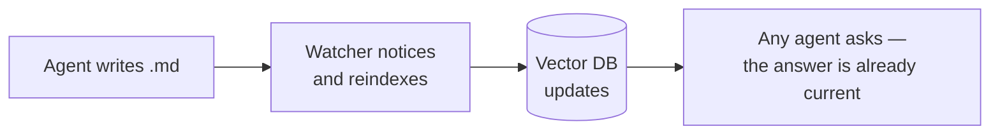

# mnemo

**Your markdown files are a universal, real-time memory for all your agents.**

You write `.md` — within a second, any agent, in any session, already sees the change. Nothing needs to be re-read — it's just already there.


## How it works

1. An agent appends what it learned to a `.md` file

2. A watcher notices the change and reindexes just that file into the vector database within seconds

3. By the next query, any agent, in any session, finds it by meaning



## Advantages

- **Markdown is the single source of truth.** Memory is edited the same way as any other file — there's no separate write tool.
- **The index can always be rebuilt from scratch.** It's only a one-way derivative of the `.md` files, so it never drifts out of sync with them.
- **One service serves every project.** No lock files, no separate model loaded per console — just a lightweight network request to a service that's already running. A new project costs one registry entry, not another process in memory.
- **Works with any number of sessions and any MCP client.** Not just Claude Code — anything that uses MCP, or plain `curl`. Every session is just another client of the same server: someone saves a file, and everyone sees it within seconds.
- **A local model computes the embeddings — nothing leaves the machine.** A remote provider can be plugged in instead, if you want one.
- **One-command install.** No deep domain knowledge needed to get the system running.

## Use cases

- **A single project.** One memory bank for the whole project, shared by every agent and session working on it — in parallel or not. One agent changes something, and everyone else already sees it in search. You can have as many banks as you like, one per project, each with its own isolated memory.
- **Team development.** `.md` is the single source of truth and travels in git alongside the code. Everyone writes to their own local memory; after a `git pull`, teammates' new files get indexed automatically, and you're immediately working off a shared, up-to-date memory, with no need to recreate sessions or agents.
- **A standalone knowledge base for an agent, outside any project.** A bank can be any folder of `.md` — it doesn't have to be a project's `.claude/memory/`. Set one up anywhere, edit it like ordinary files, and a personal AI assistant searches it the same way.

---

## Core concepts

### Memory banks

**A bank** is a directory holding any nested `.md` files. For a project, that's `<project>/.claude/memory/`.

If you need isolation, just set up another bank — separate notes for a different project or agent, for example.

Every bank logs its own events, and its index can be rebuilt independently.

### The cabinet

A local web interface — http://127.0.0.1:4646/ui

`mnemo ui` - print the link.

It has these pages:

- **Memory** — every bank with its index state, each bank's file tree, and any document with its chunk boundaries drawn in.
- **Journal** — a live feed of every bank's events: search queries and indexing runs.
- **Settings** — everything configurable: general, the embedding backend, engine updates, and diagnostics.

---

## Installing mnemo

*(This section is being reworked — a new installer is coming, so for now just the bare commands.)*

**Linux / macOS:**
```bash
git clone https://github.com/DIMKA4621/mnemo.git
cd mnemo && ./install.sh
```

**Windows:**
```powershell
git clone https://github.com/DIMKA4621/mnemo.git
cd mnemo; .\install.ps1
```

The launcher lands at `~/.mnemo/bin/mnemo` (`bin\mnemo.exe` on Windows) and isn't added to `PATH` automatically — call it by full path, or alias it once.

## Attach a project

One simple command:

```
mnemo init
```

What it does:

- registers the project's `.claude/memory/` as a bank, wires it into the cabinet, and indexes it right away;
- creates the MCP connection for it at the project root — `.mcp.json`: if the file already exists, it just adds its own entry; if not, it creates one;
- adds the rule for how to use this memory: when to search, how to write notes, how the whole layout stays current.

## Commands

Everything you need can be done through the cabinet — `mnemo ui`.

The essentials are below; for the full list — `mnemo --help`.

```
mnemo service start|stop   start / stop the service
mnemo status | doctor      service state, model, tokens, banks
mnemo ui                   link to the cabinet
mnemo init                 attach a project
mnemo search "query"       search the current directory's bank (or --bank <name>)
mnemo reindex              force a reindex (usually not needed — the watcher does it on its own)
```

---

## Uninstall

**Linux / macOS:**
```bash
./uninstall.sh 
```

**Windows:**
```powershell
.\uninstall.ps1
```

Removes everything the installer put on this machine — the service, the model cache, the index, autostart — after showing the list and asking first.

**Your projects and their `.md` files are never touched.**

### Just reinstalling?

`--keep-model`/`-KeepModel` — skips re-downloading the ~2.2 GB embedding model

`--keep-state`/`-KeepState` — skips rebuilding every bank's index from scratch.
