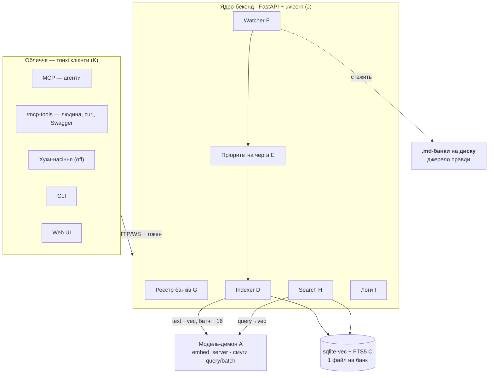

# mnemo v3 — карта реалізації (implementation plan)

> **Companion до `Memory-design-v3.md`.** Дизайн — це «що» і «чому» (джерело правди
> для рішень). Цей документ — «як, чим і в якому порядку»: стек, декомпозиція на
> блоки, інтерфейси, послідовність побудови. Тут свідомо є рівень реалізації —
> у сам дизайн-док це не заходить.
>
> Мета — підготувати все настільки точно, щоб реалізація зводилася до складання
> **окремих, чітко окреслених блоків**, кожен з яких тестовний ізольовано.
>
> **Статус реалізації.** Ядро рушія (`embed_server`, `store`, `search`, `index`,
> auto-inject хук, ключ по кореню) існувало ще до v3; v3 — це нова **обгортка**
> (персистентний бекенд + watcher + черга + HTTP + UI) навколо нього плюс рефактор
> наявного. У гілці `feat/v3` **закриті фази 0** (провайдер ембедингу, плаский банк,
> ширша стеля потоків) і **2** (реєстр банків, `service.db`, loopback-API); консоль
> **фази 6** зібраний на моках і ще не зустрівся з живим бекендом. Решта — попереду;
> ознака готовності одна: пройдена `✅ Перевірка` фази, а не «наче працює».

---

## 1. Технологічний стек

| Шар | Технологія | Статус | Нащо |
|---|---|---|---|
| Мова | Python 3.10+ x64 | є | наявний рушій |
| API / бекенд | **FastAPI + uvicorn** | нове | REST + **WebSocket** (live-прогрес) + віддача статики UI + OpenAPI |
| MCP-фасад | **`FastMCP` з наявного `mcp` SDK** (HTTP) | є (залежність) | тули `search/tree/reindex`; монтується в FastAPI (той самий uvicorn) → Claude Code конектиться по URL, без спавну |
| HTTP-клієнти | `httpx` | нове | CLI / хук → бекенд; `api`-провайдер → зовнішній ембединг |
| Стеження за файлами | **watchdog** | нове | inotify / FSEvents / ReadDirectoryChangesW |
| Вектор-БД | sqlite-vec + FTS5 | є (`store.py`) | вектори + лексика + хеші в одному файлі |
| Ембединг `local` | fastembed (ONNX), e5-large | є (`embedder.py`) | локальна модель за замовчуванням |
| Ембединг `api` (опц.) | `httpx` до зовнішнього ендпоінта | нове | плаговий провайдер |
| Модель-демон | loopback TCP + токен | є (`embed_server.py`) | тримає модель гарячою; окремий процес |
| Черга | `queue.PriorityQueue` + worker-потік | нове | пріоритет задач, почанковість |
| Реєстр банків | JSON (людиночитний конфіг) | нове | кілька коренів будь-де; правиться руками або через UI |
| Логи (сервісні) | **SQLite** `service.db` | нове | query+index події; фільтр за банком/часом; **retention за часом** — env `MNEMO_LOG_RETENTION_DAYS` |
| Web UI | статичний HTML/JS через FastAPI + WS | нове | дерево, перегляд, chunk-viz, реіндекс, логи |

**Нові залежності:** `fastapi`, `uvicorn[standard]`, `watchdog`, `httpx`.
Ставляться тим самим інсталятором рушія (`install.sh` / `install.ps1`), у наявний `.venv`.
**`fastmcp` свідомо відсутній:** уже запінений `mcp` SDK постачає серверний клас, який і монтується в FastAPI — другий дистрибутив з тією самою назвою класу дав би лише конфлікт (контракти §10.1).
**З SDK 2.0 клас зветься `mcp.server.mcpserver.MCPServer`** (у 1.x — `mcp.server.fastmcp.FastMCP`); мажор пінується (`mcp>=2.0,<3`), бо незакріплена межа зламала свіжі встановлення, лишивши наявні venv цілими — див. рішення #29 у дизайні.

---

## 2. Декомпозиція на блоки

Кожен блок: **відповідальність · інтерфейс · reuse/new**.
Стрілки залежностей — знизу вгору (верхні залежать від нижніх).

| # | Блок | Відповідальність | Інтерфейс (грубо) | Стан |
|---|---|---|---|---|
| A | **Модель-демон** | тримає модель гарячою; text→vec | TCP: `passages[]→vecs[]`, `query→vec` | є; +потоки `cpu*3//4`, +дві смуги (query/batch) в одному процесі |
| B | **Ембединг-провайдер** | абстракція `texts[]→vecs[]` | `embed(texts) -> vecs`; реалізації `local` / `api` | новий інтерфейс поверх наявного |
| C | **Store** | sqlite-vec + FTS5 + хеші | наявні `connect/insert/delete/get_*` | є; **−`scope`/`agent_name`** (банк плаский), +метадані банку/провайдера |
| D | **Indexer** | одиниця роботи → чанки → ембед → запис | `index_unit(bank, file\|batch)` | рефактор `index.py` (батчі, per-batch commit) |
| E | **Priority queue + worker** | порядок задач, почанковість | `enqueue(task, prio)`; worker бере й кличе D | нове |
| F | **Watcher** | помічає зміни банків → у чергу | watchdog → debounce → `enqueue` | нове |
| G | **Banks registry** | список коренів, resolve банку | `list()`, `resolve(bank_id) -> paths` | нове (малий конфіг) |
| H | **Search** | kNN + FTS + RRF + статус | `search(bank, q, path_prefix?) -> hits + status` | є (`search.py`); **−scope-фільтр**, +опц. `path_prefix`, +обгортка статусу |
| I | **Logs** | журнал query+index; читання з фільтром | `log_query(...)`, `log_index(...)`, `read(bank?, since?)` | **SQLite `service.db`** (заміняє JSONL); retention за часом |
| J | **Core API (FastAPI)** | єдиний loopback-API над B–I | `/search /reindex /tree /status /banks /logs` + `/ws` | нове |
| K | **Faces** | доступ до J | MCP — **FastMCP**, змонтований у J (HTTP); `/mcp-tools/*` — дзеркало тих самих тулів звичайним HTTP; CLI / Web UI / насіння-хуки — HTTP-клієнти | рефактор + новий UI |
| L | **Lifecycle** | підйом/тепло/reconcile | autostart-on-demand + reconcile-on-start | патерн є (`_spawn_server`) |

---

## 3. Карта сервісів

Одна лінія суті: **двері різні → бекенд один → у БД пише тільки він**; модель-демон — вузький помічник для векторів; файли на диску — єдине джерело правди.

---

## 4. Ембединг: важелі масштабування (у порядку дешевизни)

1. **Більше потоків одному демону.** Стеля `EMBED_THREADS = cpu*3//4` (замість `cpu//3`), override через наявний `MNEMO_EMBED_THREADS`.
   Найдешевше.
   **Заміряти** реальний приріст — ONNX за межами фізичних ядер дає спад віддачі (≈×1.5–1.8, не ×2).
   *Заміряно у фазі 0:* **≈×1.5 на 12-CPU машині, мала фікстура** — усередині передбаченої смуги, вимогу NFR-5 закриває.
   Точнішої цифри не наводимо: обидва способи виміру ганяли ту саму фікстуру крізь того самого резидента, тож їхній збіг — арифметика, а не незалежне підтвердження.
   **Перезамір throughput — на реальному банку у фазі 6.** Памʼять уже переміряно окремо (NFR-9, контракти 15.7), і головне з того заміру: **пік RSS від стелі потоків не залежить** — 9 проти 4 потоків дають 1.0 МБ різниці; пік визначає розмір батчу й найдовша послідовність у ньому.
2. **Конкурентність усередині одного резидента — дві смуги (реалізовано).** Проблема була справжня: резидент відповідав строго по одному запиту, тож пошук, що прилетів посеред індексації, ставав у чергу за цілим батчем — **виміряно 15.7 с**, а на клієнтській стелі 20 с інколи не повертав нічого.
   Специфікований лік — **пул із `N` резидентів** (нижче) — купує конкурентність ціною **другої повної копії моделі**, а оскільки резидент більше не виходить по простою, ці ~1.6 ГБ **постійні**: ~3.1 ГБ у спокої, щоб не чекати 16 с.
   Замість цього одна ONNX-сесія викликається `Run()` з кількох потоків — перевірено, що конкурентні результати **побітово** збігаються з послідовними (дельта 0.00e+00).
   Кожен рід запиту дістає **власний семафор-смугу** (`_QUERY_LANE`, `_BATCH_LANE`), а не спільну пріоритетну чергу: тому голодування неможливе в **обидва** боки — злива запитів не забере смугу батчів, довгий батч не втримає смугу запитів.
   Ні старіння, ні інверсії пріоритетів, ні тюнінгу.
   **Виміряно:** пошук падає з 15.7 с до **~0.37 с**, батч платить **~2 %**, RAM +0.
3. **Пул воркерів-демонів (`N`) — розглянуто, заміряно проти дешевшої альтернативи, НЕ реалізовано.** Задум був правильний (**конкурентність, не throughput**: на CPU-bound машині сума ядер — стеля), помилковим виявився лише **механізм**: та сама конкурентність доступна за **нуль додаткової памʼяті** — смугами вище.
   Тому `N` інстансів `embed_server` на різних портах з балансуванням (least-busy) **не будуємо**; `MNEMO_EMBED_POOL` лишається незреалізованим.
   Записано як рішення, а не викреслено мовчки: намір той самий, змінився спосіб.
4. **`api`-провайдер.** Винести ембединг у зовнішній сервіс — коли треба швидше/без локальних 2.2 ГБ; ціна — залежність і приватність (свідомий opt-in).

**Батч (зафіксовано):** одиниця запису — чанк (секція за заголовком).
Батч у демон — **обмежена група чанків (~16)**: малий файл = один батч; великий ріжеться на кілька, щоб (а) не впертись у таймаут, (б) терміновий правочок вклинювався між батчами.
*Замір, дотичний до цього числа* (16 проти 4 на довгих послідовностях: 110.0 с проти 110.6 с, ціна ~550 МБ піку) записаний у фазі 6 як контекст — рішення про розмір батчу цим **не** переглядається.

**Сортування батчу за довжиною — заміряно й НЕ потрібне.** Ідея природно випливає з того, що пік тримає найдовший чанк у батчі, тож зафіксуймо, чому її не варто подавати як оптимізацію: fastembed **уже враховує довжину**.
Батч переважно коротких чанків з одним 512-токенним коштував **539 МБ**, батч суцільних 512-токенних — **736 МБ**.
Якби padding ішов до максимуму батчу, ці числа були б **однакові**.
Тобто основне вже відіграно, і сортування добере крихти.
Це **виміряний висновок**, не думка.

---

## 5. Порядок побудови (фази — кожна окремий тестовний блок)

Правило: **фаза не вважається завершеною, поки не пройдено її перевірку.** Не переходимо далі з «наче працює».

**Фаза 0 — Фундамент** (рефактор наявного, без нової інфри)
- B: ембединг-провайдер — інтерфейс `embed(texts)`, реалізація `local` (обгортка наявного).
- A: підняти потоки демону до `cpu*3//4`, заміряти throughput.
- C: спростити схему — **прибрати `scope`/`agent_name`** (банк плаский); метадані банку/провайдера.
- Прибрати поділ `project` / `agent` з обходу файлів (одна тека = все).
- ✅ **Перевірка:** наявний CLI `ingest` + `search` на тестовому корпусі дають ті самі релевантні результати; заміряний throughput ≥ попереднього; `tests/test_search.py` зелений.

**Фаза 1 — Indexer 2.0** (рефактор `index.py`)
- D: одиниця = батч ≤16 чанків; **per-batch commit**; обхід+diff відокремлено від ембед+запис.
- ✅ **Перевірка:** великий файл (200+ чанків) індексується без таймауту; **вбити процес посеред індексації → уже зроблене збережено**, повторний запуск доробляє решту; повторний `ingest` без змін = no-op (ідемпотентність); видалений файл зникає з видачі (prune).

**Фаза 2 — Ядро-бекенд + реєстр** (перша нова інфра)
- G: banks registry (JSON: `id`, назва, корінь, провайдер) + resolve.
- J: FastAPI — `/search`, `/reindex`, `/tree`, `/status`, `/banks`, `/logs`; токен.
- H: обгортка статусу (`indexing` / `empty` / `ready`).
- I: логи → `service.db` (SQLite): query+index події, retention за часом.
- ✅ **Перевірка:** зареєстрував 2 банки з різних місць диска → `/search` по кожному дає свої результати; `/status` показує стан; порожній банк → статус `empty` (а не «нема збігів»); лог-рядки лягають у `service.db` і фільтруються за банком; API без токена → 401.

**Фаза 3 — Автономність** (черга + воркер + watcher)
- E: priority queue + worker (bulk=low, single=high; прапорець, типово on).
- F: watcher (watchdog) → debounce + hash-diff → `enqueue`.
- J: WebSocket для live-статусу/прогресу.
- ✅ **Перевірка:** правка `.md` → **без жодної команди** зʼявляється у пошуку за секунди; під час масового білду банку A правка в банку B **обганяє чергу** й індексується першою; пошук під час індексації відповідає миттєво зі статусом `indexing`; rename/delete підхоплюються; шторм збережень схлопується (debounce).

**Фаза 4 — Обличчя як клієнти**
- K: CLI → виклик API (ops `warmup`/`init` лишаються локальними); MCP на **FastMCP** (HTTP, адресація по банку); дзеркало `/mcp-tools/*` для ручної перевірки; хуки — насіння, автоматично не додаються.
- ✅ **Перевірка:** ті самі результати через CLI, MCP і HTTP; Claude Code бачить MCP **по URL** (жодного спавну, **жодного вікна** на Windows); два різні банки через два MCP-підключення не змішуються; бекенд вимкнено → CLI/MCP деградують мʼяко з поясненням, не падають.

**Фаза 5 — Процеси, автозапуск, install per-OS** (закриває NFR-1/3/6)
- L: `mnemo service start | stop | status | restart`; PID у `state/`; windowless-спавн (Windows `CREATE_NO_WINDOW`/`pythonw`, POSIX `start_new_session` + stdio→devnull).
- Автозапуск: Linux — `systemd --user` (+`enable-linger`); Windows — Task Scheduler (прихований) + реєстрація `mnemo` у PowerShell-профілі.
- Інсталятори (`install.sh` / `install.ps1`) ставлять нові deps і реєструють автозапуск.
- ✅ **Перевірка:** `service start/stop/status` керує тихо; **жодного вікна не блимає** (Windows); після **ребуту** сервіс піднявся сам і банки живі; зміни, зроблені поки сервіс лежав, підхопились на старті (reconcile-on-start).

**Фаза 6 — Web UI**
- K: статика через FastAPI — список банків, дерево, перегляд `.md`, **chunk-viz (лінії-роздільники)**, реіндекс (повний / по файлу), журнал; live-прогрес через WS.
- **Перенесено з фази 0 — і досі ВІДКРИТО, з названою причиною.** Перезамір throughput на справжньому банку **не зроблено**.
  Причина не «забули»: усі заміри цього дня йшли на машині, де паралельно працювало шість агентів, тож жодна **абсолютна** цифра throughput звідти не заслуговує довіри.
  Краще відкритий пункт із поясненням, ніж правдоподібне число.
  Що при цьому **виміряно** й лишається корисним (відносні порівняння на тому самому фоні):
  * памʼять — усталений стан 1503–1526 МБ, пік ~1.56 ГБ (короткі англійські чанки) / ~2.07 ГБ (український markdown, `BATCH_SIZE=16`); від стелі потоків пік **не залежить** (9 проти 4 потоків — 1.0 МБ різниці).
    Деталі — NFR-9 і контракти 15.7;
  * `BATCH_SIZE=16` **не дає виграшу у швидкості** проти батчу 4 на довгих послідовностях — **110.0 с проти 110.6 с** на 48 чанках — але коштує **~550 МБ** піку.
    Записано як факт; рішення про розмір батчу лишається за тимлідом.
- ✅ **Перевірка:** UI відкривається на loopback; видно банки/дерево/вміст; межі чанків збігаються з тим, що реально в індексі; кнопка реіндексу справді ставить задачу (видно прогрес через WS); журнал фільтрується за банком і глобально.
  **Перезамір throughput лишається невиконаним пунктом** — з причиною вище, а не мовчки.

**Фаза 7 — Опційне масштабування**
- B: `api`-провайдер (`httpx`).
- A: пул воркерів-демонів **знято з плану** — конкурентність дали дві смуги в одному резиденті (розділ 4, важіль 2), без другої копії моделі.
- ✅ **Перевірка:** перемикання провайдера → індекс банку перебудовується, пошук працює; терміновий запит не чекає на bulk-білд (перевіряється на смугах, не на пулі).

---

## 6. Зафіксовані рішення реалізації

- **Транзиція:** наявний `src/` **еволюціонує на місці** у v3; паралельної v2 не тримаємо — v3 стає єдиною версією.
  Фази 0–1 покращують чинну поведінку ще до нової інфри.
- **Банк плаский:** `scope`/`agent_name` зникають зі схеми, обходу й пошуку; ізоляція — окремими банками + окремими MCP-підключеннями.
- **Опційний `path_prefix`:** звуження пошуку до теки (рідше файлу) через префікс по наявному `chunks.path` — **нових метаданих не треба**, SQLite фільтрує префіксом; гнучкіше за фіксовані скоупи v2 (довільна глибина).
  Некритична фіча.
  *Нюанс:* kNN дістає топ-N по банку, а фільтр застосовується після — на маленькій підтеці у великому банку видача може бути бідною (це вже так і в v2 зі скоупами).
  Лікується збільшенням пулу при активному фільтрі або метаданими/партиціями sqlite-vec; конкретику обираємо на реалізації, заміром.
- **Міграція індексів:** ключ `sha1(root)` лишається, але корінь тепер **корінь банку**, а не проєкту → наявні `state/<projhash>.db` здебільшого не перевикористовуються.
  Індекс одноразовий і відтворюваний, тож міграція = **перебудова з `.md`** (нічого не конвертуємо).
  **Жоден файл не видаляється автоматично:**
  * якщо стара база все-таки відкривається (ключ збігся), її таблиці скидаються на місці й індекс перебудовується з `.md` — це робить `store` при `connect`;
  * якщо ключ інший — файл просто **осиротів**: v3 його ніколи не відкриває й **не чіпає**.
    Тихе видалення заборонене свідомо: на машині може лишатися проєкт, чий встановлений рушій ще v2, і його пошук помер би до повної перебудови.
    Прибирання сиріт — **явне**: `mnemo doctor` показує їх і пропонує прибрати.
- **Стек:** FastAPI + uvicorn (API/WS), **`FastMCP` з наявного `mcp` SDK** (MCP по HTTP, монтується в FastAPI), watchdog (стеження), httpx (клієнти/`api`-провайдер); нові deps у наявний `.venv` через інсталятор.
- **MCP на `FastMCP`:** транспорт HTTP, ендпоінт у тому самому FastAPI/uvicorn; `.mcp.json` → URL + токен, Claude Code процес **не спавнить** (виконує NFR-2); тули — тонкі обгортки над ядром.
  Окремий пакет `fastmcp` **не ставимо** — беремо клас із уже наявного SDK (контракти §10.1).
- **Реєстр банків:** JSON (людиночитний конфіг), правиться руками або через UI.
- **Логи:** окремий сервісний **SQLite `service.db`** (не JSONL) — query+index події, фільтр за банком/часом для UI.
  **Retention за часом:** env `MNEMO_LOG_RETENTION_DAYS` (типово 30 ≈ місяць); prune старіших рядків на старті бекенда + періодично; опційний backstop за к-стю рядків.
- **Модель-демон — окремий процес** (не всередині FastAPI); бекенд — його клієнт.
- **Потоки демону:** стеля `cpu*3//4`, override `MNEMO_EMBED_THREADS`; заміряно **≈×1.5 (12 CPU, мала фікстура)**, перезамір throughput на реальному банку у фазі 6. На пік памʼяті стеля потоків **не впливає** (1.0 МБ на A/B 9 проти 4) — розділ 4, NFR-9.
- **Батч:** обмежена група чанків (~16); малий файл = один батч.
- **Пул воркерів-демонів: не будуємо.** Мета (конкурентність, не throughput) лишається, механізм змінився: дві смуги в одному резиденті дають те саме за нуль додаткової RAM, тоді як пул коштував би постійних `N×~1.6 ГБ` (idle-виходу більше немає).
  Заміряно: пошук під час bulk 15.7 с → ~0.37 с, батч платить ~2 % (розділ 4).
- **БД пише тільки бекенд;** обличчя — тонкі клієнти (знімає гонки кількох писак з v2).
- **Lifecycle:** autostart-on-demand (патерн `_spawn_server` уже є) + reconcile-on-start (наявний hash-diff) → нічого не губиться, поки демон спав.

> Технологічні деталі нижче рівня блоків (точні сигнатури ендпоінтів, схема реєстру,
> формат WS-повідомлень) визначаємо на вході в кожну фазу, а не наперед.
