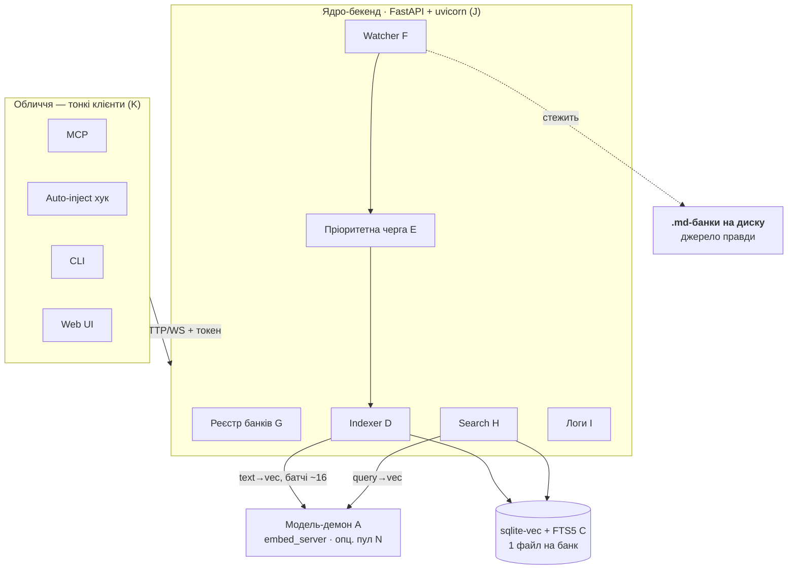

# mnemo v3 — карта реалізації (implementation plan)

> **Companion до `Memory-design-v3.md`.** Дизайн — це «що» і «чому» (джерело правди
> для рішень). Цей документ — «як, чим і в якому порядку»: стек, декомпозиція на
> блоки, інтерфейси, послідовність побудови. Тут свідомо є рівень реалізації —
> у сам дизайн-док це не заходить.
>
> Мета — підготувати все настільки точно, щоб реалізація зводилася до складання
> **окремих, чітко окреслених блоків**, кожен з яких тестовний ізольовано.
>
> **Статус реалізації сьогодні:** ~⅔ рушія вже існує й працює (`embed_server`,
> `store`, `search`, `index`, auto-inject хук, логи, ключ по кореню). v3 — це нова
> **обгортка** (персистентний бекенд + watcher + черга + HTTP + UI) навколо цього
> рушія плюс тонкий рефактор наявного.

---

## 1. Технологічний стек

| Шар | Технологія | Статус | Нащо |
|---|---|---|---|
| Мова | Python 3.10+ x64 | є | наявний рушій |
| API / бекенд | **FastAPI + uvicorn** | нове | REST + **WebSocket** (live-прогрес) + віддача статики UI + OpenAPI |
| MCP-фасад | **FastMCP** (HTTP) | нове | тули `search/tree/reindex`; монтується в FastAPI (той самий uvicorn) → Claude Code конектиться по URL, без спавну |
| HTTP-клієнти | `httpx` | нове | CLI / хук → бекенд; `api`-провайдер → зовнішній ембединг |
| Стеження за файлами | **watchdog** | нове | inotify / FSEvents / ReadDirectoryChangesW |
| Вектор-БД | sqlite-vec + FTS5 | є (`store.py`) | вектори + лексика + хеші в одному файлі |
| Ембединг `local` | fastembed (ONNX), e5-large | є (`embedder.py`) | локальна модель за замовчуванням |
| Ембединг `api` (опц.) | `httpx` до зовнішнього ендпоінта | нове | плаговий провайдер |
| Модель-демон | loopback TCP + токен | є (`embed_server.py`) | тримає модель гарячою; окремий процес |
| Черга | `queue.PriorityQueue` + worker-потік | нове | пріоритет задач, почанковість |
| Реєстр банків | JSON (людиночитний конфіг) | нове | кілька коренів будь-де; правиться руками або через UI |
| Логи (сервісні) | **SQLite** `service.db` | нове | query+index події; фільтр за банком/часом; **retention за часом** — env `MNEMO_LOG_RETENTION_DAYS` |
| Web UI | статичний HTML/JS через FastAPI + WS | нове | дерево, перегляд, chunk-viz, реіндекс, логи |

**Нові залежності:** `fastapi`, `uvicorn`, `fastmcp`, `watchdog`, `httpx`. Ставляться тим самим
інсталятором рушія (`install.sh` / `install.ps1`), у наявний `.venv`.

---

## 2. Декомпозиція на блоки

Кожен блок: **відповідальність · інтерфейс · reuse/new**. Стрілки залежностей — знизу
вгору (верхні залежать від нижніх).

| # | Блок | Відповідальність | Інтерфейс (грубо) | Стан |
|---|---|---|---|---|
| A | **Модель-демон** | тримає модель гарячою; text→vec | TCP: `passages[]→vecs[]`, `query→vec` | є; +потоки `cpu*3//4`, +опц. пул |
| B | **Ембединг-провайдер** | абстракція `texts[]→vecs[]` | `embed(texts) -> vecs`; реалізації `local` / `api` | новий інтерфейс поверх наявного |
| C | **Store** | sqlite-vec + FTS5 + хеші | наявні `connect/insert/delete/get_*` | є; +метадані банку/провайдера в БД |
| D | **Indexer** | одиниця роботи → чанки → ембед → запис | `index_unit(bank, file\|batch)` | рефактор `index.py` (батчі, per-batch commit) |
| E | **Priority queue + worker** | порядок задач, почанковість | `enqueue(task, prio)`; worker бере й кличе D | нове |
| F | **Watcher** | помічає зміни банків → у чергу | watchdog → debounce → `enqueue` | нове |
| G | **Banks registry** | список коренів, resolve банку | `list()`, `resolve(bank_id) -> paths` | нове (малий конфіг) |
| H | **Search** | kNN + FTS + RRF + scope + статус | `search(bank, q, scope) -> hits + status` | є (`search.py`) + обгортка статусу |
| I | **Logs** | журнал query+index; читання з фільтром | `log_query(...)`, `log_index(...)`, `read(bank?, since?)` | **SQLite `service.db`** (заміняє JSONL); retention за часом |
| J | **Core API (FastAPI)** | єдиний loopback-API над B–I | `/search /reindex /tree /status /banks /logs` + `/ws` | нове |
| K | **Faces** | доступ до J | MCP — **FastMCP**-ендпоінт у J (HTTP); CLI / хук / Web UI — HTTP-клієнти | рефактор + новий UI |
| L | **Lifecycle** | підйом/тепло/reconcile | autostart-on-demand + reconcile-on-start | патерн є (`_spawn_server`) |

---

## 3. Карта сервісів

Одна лінія суті: **двері різні → бекенд один → у БД пише тільки він**; модель-демон —
вузький помічник для векторів; файли на диску — єдине джерело правди.

---

## 4. Ембединг: важелі масштабування (у порядку дешевизни)

1. **Більше потоків одному демону.** Стеля `EMBED_THREADS = cpu*3//4` (замість `cpu//3`),
   override через наявний `MNEMO_EMBED_THREADS`. Найдешевше. **Заміряти** реальний
   приріст — ONNX за межами фізичних ядер дає спад віддачі (≈×1.5–1.8, не ×2).
2. **Опційний пул воркерів-демонів** (`N`, default **1**). Сенс — **не throughput, а
   конкурентність**: поки bulk-білд зайняв воркер, терміновий query-embed іде на
   вільний і не чекає. На CPU-bound машині throughput не множиться (сума ядер — стеля),
   ціна — `N×~1.6 ГБ` RAM. Тому `N=2` за потреби, не 5. Реалізація: N інстансів
   `embed_server` на різних портах, бекенд балансує (least-busy).
3. **`api`-провайдер.** Винести ембединг у зовнішній сервіс — коли треба швидше/без
   локальних 2.2 ГБ; ціна — залежність і приватність (свідомий opt-in).

**Батч (зафіксовано):** одиниця запису — чанк (секція за заголовком). Батч у демон —
**обмежена група чанків (~16)**: малий файл = один батч; великий ріжеться на кілька,
щоб (а) не впертись у таймаут, (б) терміновий правочок вклинювався між батчами.

---

## 5. Порядок побудови (фази — кожна окремий тестовний блок)

**Фаза 0 — Фундамент** (рефактор наявного, без нової інфри)
- B: ембединг-провайдер — інтерфейс `embed(texts)`, реалізація `local` (обгортка наявного).
- A: підняти потоки демону до `cpu*3//4`, заміряти throughput.
- C: additive-міграція схеми — метадані банку/провайдера.
→ *Дає:* чистий інтерфейс + швидший ембединг. Ганяється наявним CLI.

**Фаза 1 — Indexer 2.0** (рефактор `index.py`)
- D: одиниця = батч ≤16 чанків; **per-batch commit**; функція приймає завдання ззовні
  (обхід+diff відокремлено від ембед+запис).
→ *Дає:* індексація не втрачає прогрес і не впирається в таймаут. Ще без сервісу.

**Фаза 2 — Ядро-бекенд + реєстр** (перша нова інфра)
- G: banks registry (конфіг + resolve).
- J: FastAPI-застосунок — `/search`, `/reindex`, `/tree`, `/status`, `/banks`, `/logs`; токен.
- H: обгортка статусу (`indexing` / `empty` / `ready`).
- I: логи → `service.db` (SQLite): запис query+index подій, retention за часом.
- L: autostart-on-demand + reconcile-on-start.
→ *Дає:* один персистентний бекенд, доступний по HTTP.

**Фаза 3 — Автономність** (черга + воркер + watcher)
- E: priority queue + worker (bulk=low, single=high; прапорець, типово on).
- F: watcher (watchdog) → debounce + hash-diff → `enqueue`.
- J: WebSocket для live-статусу/прогресу.
→ *Дає:* «підключив і працює» — само підхоплює зміни у фоні.

**Фаза 4 — Обличчя як клієнти**
- K: CLI → виклик API (ops `warmup`/`init` лишаються локальними); MCP → клієнт API;
  auto-inject хук → клієнт `/search` (логіка є, змінюємо джерело).
→ *Дає:* усі двері в один бекенд; кінець кільком писакам у БД.

**Фаза 5 — Web UI**
- K: статика через FastAPI — список банків, дерево, перегляд `.md`, **chunk-viz
  (лінії-роздільники)**, кнопки реіндексу (повний / по файлу), журнал (query+index),
  фільтр по банку та глобально; live-прогрес через WS.
→ *Дає:* видимість і контроль.

**Фаза 6 — Опційне масштабування**
- B: `api`-провайдер (`httpx`).
- A: пул воркерів-демонів (N, default 1) з балансуванням.
→ *Дає:* важелі під навантаження / приватність.

---

## 6. Зафіксовані рішення реалізації

- **Стек:** FastAPI + uvicorn (API/WS), **FastMCP** (MCP по HTTP, монтується в FastAPI),
  watchdog (стеження), httpx (клієнти/`api`-провайдер); нові deps у наявний `.venv` через інсталятор.
- **MCP на FastMCP:** транспорт HTTP, ендпоінт у тому самому FastAPI/uvicorn; `.mcp.json` →
  URL + токен, Claude Code процес **не спавнить** (виконує NFR-2); тули — тонкі обгортки над ядром.
- **Реєстр банків:** JSON (людиночитний конфіг), правиться руками або через UI.
- **Логи:** окремий сервісний **SQLite `service.db`** (не JSONL) — query+index події, фільтр
  за банком/часом для UI. **Retention за часом:** env `MNEMO_LOG_RETENTION_DAYS` (типово 30 ≈
  місяць); prune старіших рядків на старті бекенда + періодично; опційний backstop за к-стю рядків.
- **Модель-демон — окремий процес** (не всередині FastAPI); бекенд — його клієнт.
- **Потоки демону:** стеля `cpu*3//4`, override `MNEMO_EMBED_THREADS`; заміряти.
- **Батч:** обмежена група чанків (~16); малий файл = один батч.
- **Пул воркерів:** опційний, default 1; сенс — конкурентність, не throughput; `N=2` за потреби.
- **БД пише тільки бекенд;** обличчя — тонкі клієнти (знімає гонки кількох писак з v2).
- **Lifecycle:** autostart-on-demand (патерн `_spawn_server` уже є) + reconcile-on-start
  (наявний hash-diff) → нічого не губиться, поки демон спав.

> Технологічні деталі нижче рівня блоків (точні сигнатури ендпоінтів, схема реєстру,
> формат WS-повідомлень) визначаємо на вході в кожну фазу, а не наперед.
